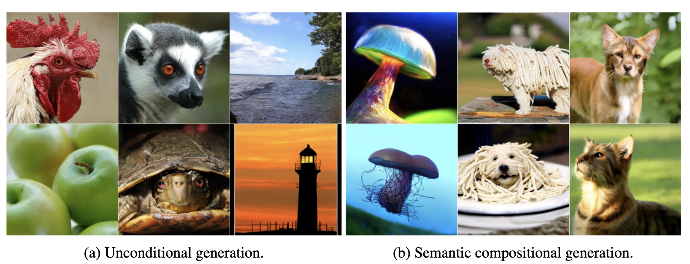

# Compositional Discrete Latent Code for High Fidelity, Productive Diffusion Models

📄[Paper]() 📁[DLC dataset](#-DLC-datasets) 📀[Models](#-Pre-trained-models) 🖌[BibTex](#-Citation) 📚[References](#-Reference)

**Authors**: Samuel Lavoie, Michael Noukhovitch, Aaron Courville



*Compositional Discrete Latent Code for High Fidelity, Productive Diffusion Models.*

We introduce compositional discrete latent codes (DLCs), which enable both high-fidelity image generation and compositional generation in diffusion models.
Below, we provide the code, DLC datasets, pretrained models, and instructions to do inference with pre-trained models using HuggingFace 🤗.\

The code is organized in folders:
* The code to reproduce the SEM encoder: [./dinov2](./dinov2)
* The code to reproduce the DLC generator: [./sedd](./sedd)
* The code to reproduce the DLC to image generator and text-and-image LLADA fine-tuning: [./dit](./dit).

## ⚙️  Installation
The python packages to train all of the models can be installed using the following commands:
```bash
virtualenv env
source env/bin/activate
pip install -r requirement.txt
pip install flash_attn
pip install --no-build-isolation --no-deps git+https://github.com/facebookresearch/xformers.git
pip install -e dinov2
```

# 📁 DLC datasets

We provide ImageNet as 512x256 DLCs dataset that was used train the DLC-SEDD and the DLC-DiT models. 
The dataset was produced by encoding ImageNet using the SEM-DinoV2 models and taking the DLC.


| DLC shape        | HF dataset |
| --------------   | ------- |
| $512\times 256$  | [lavoies/DLC_512x256](https://huggingface.co/datasets/lavoies/DLC_512x256)  |

Using this dataset:
```
from datasets import load_dataset

dataset = load_dataset("lavoies/DLC_512x256", split="train")
features = dataset[0]['features']
dlc = dataset[0]['labels']
```

# 📀 Pre-trained models


## Pre-trained SEM Encoders

DLC encodings are simply discretized [SEMs](https://arxiv.org/abs/2204.00616). 
We provide pre-trained SEM encoders converted to Huggingface models and uploaded to the hub. 
The encoder is based on Dinov2, and fine-tuned with ImageNet-1k data.
The corresponding DLCs achieve 85.3 linear probe accuracy on ImageNet-1k.

| DLC shape        | ImageNet1k Lin prob acc on DLC |   HF model    |
| --------------   | ----------------- | ------------- |
| $512\times 256$  | 85.3              | [lavoies/SEM_dinov2_L512](https://huggingface.co/lavoies/SEM_dinov2_L512)  |

Encoding an image using the Huggingface model can be achieved as follows:
```
import requests
from PIL import Image
from transformers import AutoImageProcessor, AutoModel

url = 'http://images.cocodataset.org/val2017/000000039769.jpg'
image = Image.open(requests.get(url, stream=True).raw)

processor = AutoImageProcessor.from_pretrained('lavoies/SEM_dinov2_L512', trust_remote_code=True)
model = AutoModel.from_pretrained('lavoies/SEM_dinov2_L512', trust_remote_code=True)

inputs = processor(images=image, return_tensors="pt")
outputs = model(**inputs)
sem = outputs.sem
dlc = outputs.dlc
```

## Pre-trained DLC-SEDD
| DLC shape         | HF model |
| --------------    | ------------- |
| $512\times 256$   | [lavoies/DLC_SEDD_L512](https://huggingface.co/lavoies/DLC_SEDD_L512)  |

Loading DLC SEDD can be achieved as follows:
```
from transformers import AutoModel

model = AutoModel.from_pretrained('lavoies/DLC_SEDD_L512', trust_remote_code=True)
```

## Pre-trained DLC-DiT
| DLC shape         | HF model |
| --------------    | ------------- |
| $512\times 256$   | [lavoies/DLC_DiT_L512](https://huggingface.co/lavoies/DLC_DiT_L512)  |

Loading DLC DiT custom pipeline can be achieved as follows:
```
from ditpipeline_dlc_dit import DLCDiTPipeline

pipe = DLCDiTPipeline.from_pretrained('lavoies/DLC_DiT_L512', trust_remote_code=True)
```

## Fine-tuned text-and-DLC LLADA model
| DLC shape | HF model |
| ----------| -------- |
| $512\times 256$ | [lavoies/DLC_LLADA_L512](https://huggingface.co/lavoies/DLC_LLADA_L512) |
Loading LLADA can be achieved as follows
```
from transformers import AutoModel

model = AutoModel.from_pretrained('lavoies/DLC_LLADA_L512', trust_remote_code=True)
```

## Unconditional generation
Unconditional generation can be achieved running the following scripts:
```
python sedd/run_sample.py --sample_dir . --model_path lavoies/DLC_SEDD_L512  --batch_size 32 --steps 512 --total_samples 32 --save_name uncond
python dit/sample_sem.py --model lavoies/DLC_DiT_L512 --cfg-scale 1.5 --image-size 256 --sem-path diffused_SEMs/uncond.pt
```

## Text-to-image generation
Text-to-image generation can be achieved running the following scripts:
```
PROMPT="An image of a golden retriever"

python dit/chat_sem.py --model_name_or_path lavoies/DLC_LLADA_L512 --output_path golden.pt --remasking random --L 512 --V 256 --temperature 0.2 --steps 512 --num_samples 3 --prompt="$PROMPT"
python dit/sample_sem.py --model lavoies/DLC_DiT_L512 --cfg-scale 3 --image-size 256 --sem-path golden.pt
```


# 🖌 Citation

# 📚 References

Our implementation builds upon three prior works:
* The SEM encoder is built upon [DinoV2](https://github.com/facebookresearch/dinov2).
* The DLC generative model implementation is built upon [SEDD](https://github.com/louaaron/Score-Entropy-Discrete-Diffusion)
* The DLC-to-image generation is built upon [Fast-DiT](https://github.com/chuanyangjin/fast-DiT), which itself is built upon [DiT](https://github.com/facebookresearch/DiT).

